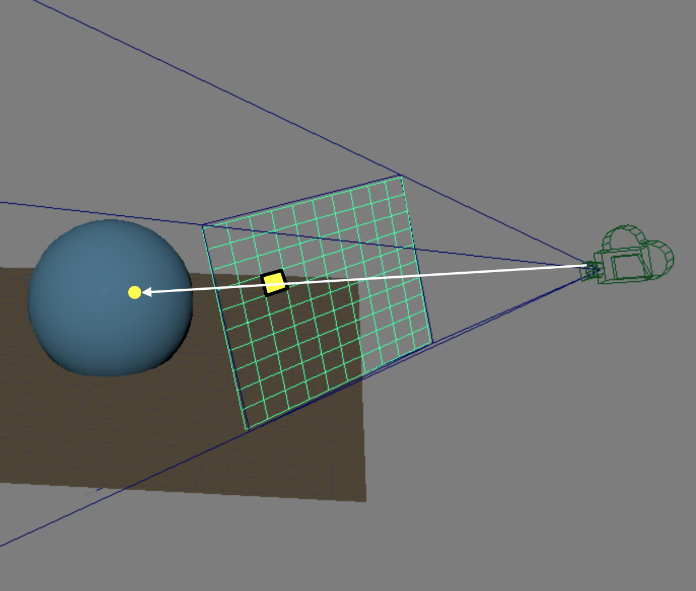

<!--
 * @FilePath: \projects_ray\docs\ray_1\README.md
 * @Author: AceSix
 * @Date: 2022-07-08 21:25:24
 * @LastEditors: AceSix
 * @LastEditTime: 2022-07-08 21:39:22
 * Copyright (C) 2022 Brown U. All rights reserved.
-->
# Projects 3: Ray

### Introduction to Computer Graphics, Fall 2022

*Due:*

## 1 Introduction

In this assignment, you will implement the **basic part** of your ray tracer, an intersection check pipeline that simulates how ray bounces in a scene. 

- Generating and casting rays
- Finding the closest intersection point
  - Implicit shape primitives
  - Intersection pipeline

The following diagram shows an example of one ray shooting through a pixel on the viewplane and intersecting with a sphere in the scene. You ultimate goal of this assignment is to implement this process with the given scene data.

    
    <figcaption align = "center"> <b>Fig. 1</b> 
    Casting ray from camera
    </figcaption>

## 2 Requirements

This assignment is out of 100 points

* Parsing the scene **(5pts)**
* Casting ray from camera **(10pts)**
* Intersection check pipeline **(35pts)**
* Four implicit shape primitives **(20pts)**:
  * Cube **(5pts)**
  * Sphere **(5pts)**
  * Cylinder **(10pts)**
  * Cone **(10pts)**
* Efficiency **(15pts)**
* Software Engineering & Stability **(10pts)**
* README **(5pts)**

### 2.0 Parsing the scene

We are going to use the same scenefile from the parser lab to describe a scene. For your ray tracer, you will load the scene from a scenefile, parse it, and then render the scene using the ray tracing algorithm. 

Hence, first thing first, you need to be able to correctly parse the scene and you have already completed this part in the parsing lab. **If you haven't, please make sure you complete the parsing lab first before you start working on the ray project.**

Please refer to section 3.1 on where to implement the parser.

### 2.1 Generating and casting rays

In order to generate and cast rays into the scene, you will need to shoot rays through a pixel on the viewplane. For basic requirements, **you are only required to shoot one ray through the center of each pixel**.

  
 Can we do better? 

  Of course you can have more samples. And having only one sample per pixel is definitely going to cause aliasing. You have encountered the notion of aliasing in previous lectures and in the last assignment. 

  

    
    <figcaption align = "center"> <b>Fig. 2</b> 
    Comparison between the baseline output and the super-sampling applied output
    </figcaption>
  

  
  There are various ways to resolve this issue. Check the extra credit section if you are interested.

### 2.2 Finding intersection point

In order to find an intersection point, we first have to define our shapes. As covered in lectures, we are going to use implicit functions to define our shapes. You are required to be able to correctly handle the following types of shapes using implicit functions. 

- Cube
- Cone
- Cylinder
- Sphere

### 2.3 “Illumination”
In this assignment, you are not required to handle any lighting. Yet, it would still be nice to be able to distinguish between different primitives in the scene and verify the implementation. To do this, **simply use the normal value as the color**.

Here are some sample outputs of what your ray tracer should be capable of by the end of this assignment.

  

    
    <figcaption align = "center"> <b>Fig. 3</b> 
    Sample output
    </figcaption>
  

## 3 Project Stencil

### 3.1 Codebase

The codebase is structured with three modules.

- The `utils` module provides the utilities you will use for the ray tracer. You should implement the `SceneParser` as you have done similarly in the parsing lab.

- The `camera` module contains everything related to camera operation. The `Camera.h` is an interface for the camera which tells you what a camera should be fully capable of. However, for the purpose of the Ray assignment, you won't need its full functionality, but only a tiny part of it. The `RayCamera` is the class that you are actually going to implement. You should conform to the `Camera` interface when implementing `RayCamera`.

- The raytracer module is the main component of this assignment, although it only contains two classes, `RayTraceScene` and `RayTracer`. The class names already give out what they are used for. 
  - In `RayTraceScene`, you will construct the scene using the RenderData you filled in the `SceneParser`
  - In `RayTracer`, You will implement the ray tracing algorithm. It takes in a `RayTraceScene` as the render parameter.

### 3.2 Design

Please do keep in mind that you are only implementing parts of your ray tracer, and you will keep working in the same repo in the next assignment. 

When making your design choices, think a bit further about what could be needed in the next assignment. You can take a look at the handout for the next assignment to get some idea on what you are expected to do.

## 4 Extra Credits

* **Acceleration data structure**: There are various ways to build an acceleration data structure. Here are the approaches that are covered in the lecture.
    * Octree
    * BVH
    * KD-Tree
* **Parallelization**: There are many ways to parallelize your code. It can be as simple as one line of code in OpenMP. It can also go up to a carefully designed task scheduler that acts like Cinebench. Evidently, the grades you receive will be based on the complexity of your implementation. If you have more questions on the rubric and design choice, come to TA hours and we are happy to help.
    * OpenMP
    * Qt based implementation that has limited control of scheduling
    * Qt based implementation that has concrete control on scheduling
* **Anti-aliasing**: As we are only shooting one ray through the center of each pixel, it can be expected that there will be aliasing. In your filter project, you’ve learnt some ways to fix aliasing as a post-processing approach. Try to figure out if you can integrate your filter into your ray tracer as a post-processing module for your output image.
*  **Super-sampling**: As mentioned above, the source of aliasing is the low number of samples. So the most direct way to resolve it is to increase the number of samples. Here are a few ways to do super-sampling.
    * Naive super-sampling
    * Adaptive super-sampling

## 5 README

You must submit a README in Markdown format. This file should contain basic information about your design choices. You should also include any known bugs or any extra credits you’ve implemented. Please note that the README is worth **5 points** of your assignment grade!

## 6 Handling in

To submit your assignment, upload your repo to Gradescope via Github. For all assignments in this course, we will test your code on department machines, so we expect your code to be able to compile on department machines. If you are developing locally, please test your code before submitting. If your code does not compile, we will ask you to resubmit and this will result in a late penalty!

## 7 FAQ & Hints

### 7.1 Nothing shows up

Start with a simple scene, like the scene with only one primitive and make sure it’s working.

Think thoroughly about the whole ray tracing pipeline before start writing your code. What are the transformations needed to compute the final output? Does your math and number make sense? Is there any negative value or extremely large value during the computation?

Utilize the QtCreator debugger to debug.

### 7.2 My ray tracer runs extremely slow :(

Since the time complexity of the naive ray tracing algorithm is $O(MN)$, where M is the number of pixels and N is the number of primitives, it inevitably is going to be slow when the number of primitives in the scene gets large. 

But that’s not the end of the world and here are some tips for you at different stages.

**When you are still working on your project:**

Typically, modern CPUs should have enough horsepower to handle most of our scenes. Yet, you still definitely want to render your scene in a flash to check for bugs and errors. 

One thing you can do is to limit the resolution of your output image. Our default rendering resolution is $800\times800$, but you can reduce it by half or even more. And of course, you don’t want to start with any extremely complex scene. Here is the list of complex scenes that you should be aware of.

- List of complex scenes

Despite these scenes being complex, it does not mean that we are not going to test them on your ray tracer for grading. You are still expected to output reasonable results on these scenes in a reasonable amount of time.

**When you have finished the basic requirements and are looking for more:**

As covered in the lecture, ray tracing is ‘embarrassingly parallel’. Therefore, you can boost your performance simply by making your ray tracer parallel. And there are tons of ways to achieve this. Please refer to the extra credits section for more information.

It’s worth noting that acceleration data structure also offers **significant** performance boost. And there are plenty of choices for you.

If you are registered for the half-credit, it is strongly recommended that you do both for the requirement.
